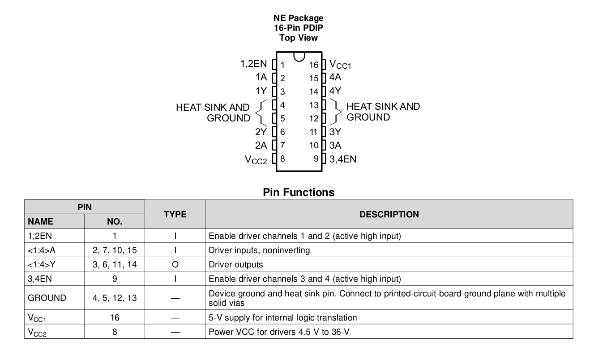

stm32F
103C8T6
9910X RR93

# STM32F103C8T6 Pinout

# NRF24 Pinout:

Arduino Pins:

- PA4: CS
- PA5: SCK
- PA6: MISO
- PA7: MOSI
- PB0: CE
- 3.3V: VCC

# LM293D Pinout

Arduino Pins

- pinD1A = PB4;
- pinD1B = PB5;
- pinD2A = PB6;
- pinD2B = PB7;
- pinEN1 = PB3;
- pinEN2 = PB9;
